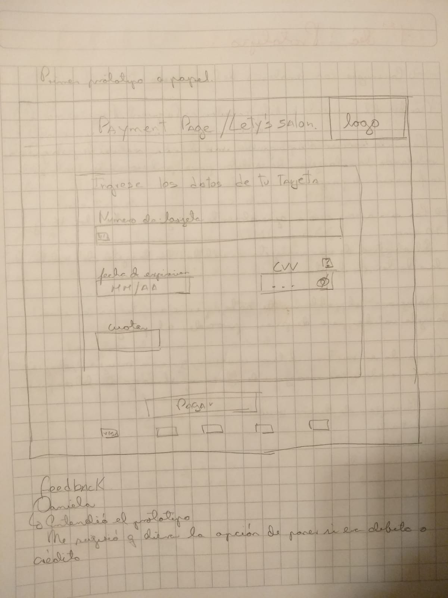
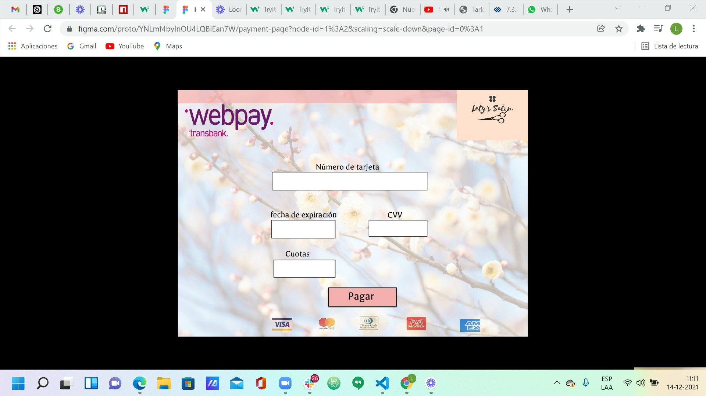

# Tarjeta de crédito válida

Título del proyecto : Lety´s salon´s payment page.

Crear la sesión de pago de una tienda virtual de peluquería, validando las tarjetas de crédito, para posteriormente
realizar la confirmación de pago.

 Los usuarios a los que va pensado el proyecto, son generalmente mujeres entre los 16 y 70 años. El objetivo de este
 proyecto es validar las tarjetas de crédito en la página web de una peluquería que vende productos para el embellecimiento
 del cabello y la piel.
 Soluciona el problema de validar en primera instancia si es válida o no la tarjeta de crédito
 para posteriormente proceder a realizar el pago. Pensando en nuestros futuros usuarios y en correspondencia con el tema
 de la página y las características propias del cliente, decidí usar colores rosados pasteles y una imágen de backgraound
 con flores y tonalidades suaves, para hacer relajante la visualización.
 Se utilizó el logo propio de la marca y se uso
 como referente para los colores. Se uso el logo de webpay en la opcion rosa para que quedará mejor con el resto de 
 elementos y imágenes referenciales de tipos de tarjetas de crédito, para que fuera más fácil la identificación por parte
 del usuario de las tarjetas disponibles para usar como forma de pago. El cuadro del formulario se centró ya que 
 es el elemento más importante y se uso colores blanco y negro para darle mayor seriedad e importancia. Se identificó 
 el botón pagar para destacarlo e insinuar su funcionalidad. Se usaron también los diferentes tamaños de letras diferenciar
 y dar jerarquía a los elementos.
 
 Una vez analizado que deseaba realizar, pensar en los usuarios y en las necesidades del cliente,  decidi comenzar a realizar
 mi prototipo en papel. Le pedí feedback a mi compañera Daniela Alcalá. Ella comprendió mi prototipo. Le comenté sobre los
 los colores que deseaba usar y quedamos que una vez realizara mi diseño en Figma realizariamos feedback nuevamente. 
  
 
 Cuando realizé mi prototipo en Figma, pedi nuevamente su feedback.
 
 Me recomendó cambiar el color de mi barra superior
 por un color más parecido al del logo. Pude cambiar asi tambien el color del boton y agregarle borde, para dar la sensacíon 
 de funcionalidad. Me sugirió quitarle la linea divisoria de la barra superior. Logré con su ayuda, crear una página más
 limpia y armoniosa. Me sirvió de mucho el feedback ya que pude exponer mis ideas y recibir ayuda y la opinión de una
 compañera.

Mi página web final, con total funcionalidad.

 
